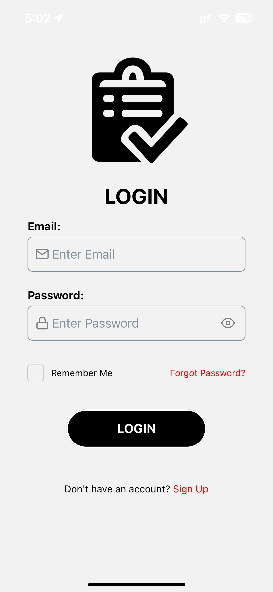

# Personal Task Manager

A simple yet feature-rich Personal Task Manager application built using React Native with Expo. Manage your daily tasks, track progress, and stay organized effortlessly.

## Table of Contents

- [Features](#features)
- [Screenshots](#screenshots)
- [Installation](#installation)
- [Technologies Used](#technologies-used)
- [Contributing](#contributing)

## Features

- **User Authentication:** Securely register and login to manage your tasks privately.
- **Task Management:**
  - Create new tasks with titles, descriptions, and due dates.
  - Mark tasks as complete with a satisfying animation.
  - Edit existing tasks to update details.
  - Delete tasks that are no longer needed.
- **Task Filtering:**
  - View tasks filtered by:
    - All tasks
    - Due Today
    - Due Tomorrow
    - Due in 1 Week
    - Due in 1 Year
    - Pending
    - Completed
- **Settings:**
  - View user profile and account information.
  - Sign out from the application.
  - Delete account permanently.

## Screenshots

<table>
  <tr>
    <td></td>
    <td></td>
    <td></td>
    <td></td>
  </tr>
  <tr>
    <td></td>
    <td></td>
    <td></td>
    <td></td>
  </tr>
</table>

## Installation

1. Clone the repository:

    ```bash
    git clone https://github.com/PranavArya37/PersonalTaskManager-App.git
    ```

2. Navigate to the project directory:

    ```bash
    cd PersonalTaskManager
    ```

3. Install dependencies:

    ```bash
    npm install
    ```

4. Start the development server:

    ```bash
    npx expo start
    ```

## Usage

1. Sign up or log in to create a new account or access an existing one.
2. Create, edit, and delete tasks as needed.
3. Filter tasks by status and due date.
4. View all tasks, pending tasks, and completed tasks.

## Technologies Used

- React Native
- Expo
- React Navigation
- React Native Async Storage
- React Native Elements
- React Native Paper

## Contributing

Contributions are welcome! If you find any bugs or have suggestions for new features, please open an issue or submit a pull request.
